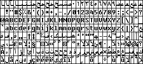
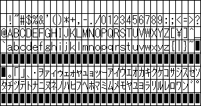
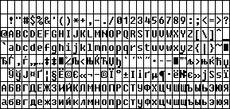
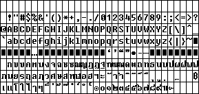
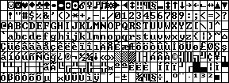

# Stock Windows Fonts

## FON

### 8514

| File name       | Font name   | Locale      | Dimensions      | Preview                            |
| --------------- | ----------- | ----------- | --------------- | ---------------------------------- |
| 8514fix.fon     | Fixedsys    | American    | 10x20 /16, 12pt |    |
| 85f1256.fon     | Fixedsys    | Arabic      | 10x20 /16, 12pt |    |
| 85f1257.fon     | Fixedsys    | Baltic      | 10x20 /16, 12pt |    |
| 8514fixe.fon    | Fixedsys    | European    | 10x20 /16, 12pt |  |
| 8514fixg.fon    | Fixedsys    | Greek       | 10x20 /16, 12pt |  |
| 85f1255.fon     | Fixedsys    | Hebrew      | 10x20 /16, 12pt |    |
| j8514fix.fon    | Fixedsys    | Japanese    | 10x22 /20, 12pt |  |
| h8514fix.fon    | Fixedsys    | Korean      | 10x20 /16, 12pt |  |
| 8514fixr.fon    | Fixedsys    | Russian     | 10x20 /16, 12pt |  |
| s8514fix.fon    | Fixedsys    | S. Chinese  | 10x20 /16, 12pt |  |
| c8514fix.fon    | Fixedsys    | T. Chinese  | 10x20 /16, 12pt |  |
| 85f874.fon      | Fixedsys    | Thai        | 10x20 /16, 12pt |      |
| 8514fixt.fon    | Fixedsys    | Turkish     | 10x20 /16, 12pt |  |
| 8514sys.fon     | System      | American    |  Nx20 /16, 10pt |    |
| 85s1256.fon     | System      | Arabic      |  Nx20 /16, 10pt |    |
| 85s1257.fon     | System      | Baltic      |  Nx20 /16, 10pt |    |
| 8514syse.fon    | System      | European    |  Nx20 /16, 10pt |  |
| 8514sysg.fon    | System      | Greek       |  Nx20 /16, 10pt |  |
| 85s1255.fon     | System      | Hebrew      |  Nx20 /16, 10pt |    |
| j8514sys.fon    | System      | Japanese    |  Nx22 /20, 12pt |  |
| h8514sys.fon    | System      | Korean      |  Nx20 /16, 10pt |  |
| 8514sysr.fon    | System      | Russian     |  Nx20 /16, 10pt |  |
| s8514sys.fon    | System      | S. Chinese  |  Nx20 /16, 10pt |  |
| c8514sys.fon    | System      | T. Chinese  |  Nx20 /16, 10pt |  |
| 85s874.fon      | System      | Thai        |  Nx20 /16, 10pt |      |
| 8514syst.fon    | System      | Turkish     |  Nx20 /16, 10pt |  |
| 8514oem.fon     | Terminal    | American    | 10x20 /16, 12pt |    |
| 85775.fon       | Terminal    | CP775       | 10x20 /16, 12pt |        |
| 85855.fon       | Terminal    | CP855       | 10x20 /16, 12pt |        |
| 8514oeme.fon    | Terminal    | European    | 10x20 /16, 12pt |  |
| 8514oemg.fon    | Terminal    | Greek       | 10x20 /16, 12pt |  |
| j8514oem.fon    | Terminal    | Japanese    | 10x22 /20, 12pt |  |
| h8514oem.fon    | Terminal    | Korean      | 10x20 /16, 12pt |  |
| 8514oemr.fon    | Terminal    | Russian     | 10x20 /16, 12pt |  |
| s8514oem.fon    | Terminal    | S. Chinese  | 10x20 /16, 12pt |  |
| c8514oem.fon    | Terminal    | T. Chinese  | 10x22 /20, 12pt |  |
| 8514oemt.fon    | Terminal    | Turkish     | 10x20 /16, 12pt |  |

### CGA

| File name       | Font name   | Locale      | Dimensions      | Preview                            |
| --------------- | ----------- | ----------- | --------------- | ---------------------------------- |
| cga40woa.fon    | Terminal    | CP437       |  16x8  /7,  9pt |  |
| cga40737.fon    | Terminal    | CP737       |  16x8  /7,  9pt |  |
| cga40850.fon    | Terminal    | CP850       |  16x8  /7,  9pt |  |
| cga40852.fon    | Terminal    | CP852       |  16x8  /7,  9pt |  |
| cga40857.fon    | Terminal    | CP857       |  16x8  /7,  9pt |  |
| cga40866.fon    | Terminal    | CP866       |  16x8  /7,  9pt |  |
| cga40869.fon    | Terminal    | CP869       |  16x8  /7,  9pt |  |
| cga80woa.fon    | Terminal    | CP437       |   8x8  /7,  8pt |  |
| cga80737.fon    | Terminal    | CP737       |   8x8  /7,  8pt |  |
| cga80850.fon    | Terminal    | CP850       |   8x8  /7,  8pt |  |
| cga80852.fon    | Terminal    | CP852       |   8x8  /7, 12pt |  |
| cga80857.fon    | Terminal    | CP857       |   8x8  /7,  8pt |  |
| cga80866.fon    | Terminal    | CP866       |   8x8  /7,  8pt |  |
| cga80869.fon    | Terminal    | CP869       |   8x8  /7,  8pt |  |

### EGA

| File name       | Font name   | Locale      | Dimensions      | Preview                            |
| --------------- | ----------- | ----------- | --------------- | ---------------------------------- |
| ega40woa.fon    | Terminal    | CP437       | 16x12 /10, 11pt |  |
| ega40737.fon    | Terminal    | CP737       | 16x12 /10, 11pt |  |
| ega40850.fon    | Terminal    | CP850       | 16x12 /10, 11pt |  |
| ega40852.fon    | Terminal    | CP852       | 16x12 /10, 11pt |  |
| ega40857.fon    | Terminal    | CP857       | 16x12 /10, 11pt |  |
| ega40866.fon    | Terminal    | CP866       | 16x12 /10, 11pt |  |
| ega40869.fon    | Terminal    | CP869       | 16x12 /10, 11pt |  |
| ega80woa.fon    | Terminal    | CP437       |  8x12 /10, 12pt |  |
| ega80737.fon    | Terminal    | CP737       |  8x12 /10, 12pt |  |
| ega80850.fon    | Terminal    | CP850       |  8x12 /10, 12pt |  |
| ega80852.fon    | Terminal    | CP852       |  8x12 /10, 12pt |  |
| ega80857.fon    | Terminal    | CP857       |  8x12 /10, 12pt |  |
| ega80866.fon    | Terminal    | CP866       |  8x12 /10, 12pt |  |
| ega80869.fon    | Terminal    | CP869       |  8x12 /10, 12pt |  |

### VGA

| File name       | Font name   | Locale      | Dimensions      | Preview                            |
| --------------- | ----------- | ----------- | --------------- | ---------------------------------- |
| vgafix.fon      | Fixedsys    | American    |  8x15 /12, 12pt |      |
| vgaf1256.fon    | Fixedsys    | Arabic      |  8x15 /12, 12pt |  |
| vgaf1257.fon    | Fixedsys    | Baltic      |  8x15 /12, 12pt |  |
| vgafixe.fon     | Fixedsys    | European    |  8x15 /12, 12pt |    |
| vgafixg.fon     | Fixedsys    | Greek       |  8x15 /12, 12pt |    |
| vgaf1255.fon    | Fixedsys    | Hebrew      |  8x15 /12, 12pt |  |
| jvgafix.fon     | Fixedsys    | Japanese    |  8x18 /16, 12pt |    |
| hvgafix.fon     | Fixedsys    | Korean      |  8x16 /13, 12pt |    |
| vgafixr.fon     | Fixedsys    | Russian     |\*8x16 /12, 12pt |    |
| svgafix.fon     | Fixedsys    | S. Chinese  |  8x16 /13, 12pt |    |
| cvgafix.fon     | Fixedsys    | T. Chinese  |  8x16 /13, 12pt |    |
| vgaf874.fon     | Fixedsys    | Thai        |  8x16 /12, 12pt |    |
| vgafixt.fon     | Fixedsys    | Turkish     |  8x15 /12, 12pt |    |
| vgasys.fon      | System      | American    |  Nx16 /13, 10pt |      |
| vgas1256.fon    | System      | Arabic      |  Nx16 /13, 10pt |  |
| vgas1257.fon    | System      | Baltic      |  Nx16 /13, 10pt |  |
| vgasyse.fon     | System      | European    |  Nx16 /13, 10pt |    |
| vgasysg.fon     | System      | Greek       |  Nx16 /13, 10pt |    |
| vgas1255.fon    | System      | Hebrew      |  Nx16 /13, 10pt |  |
| jvgasys.fon     | System      | Japanese    |  Nx18 /16, 12pt |    |
| hvgasys.fon     | System      | Korean      |  Nx16 /13, 10pt |    |
| vgasysr.fon     | System      | Russian     |  Nx16 /13, 10pt |    |
| svgasys.fon     | System      | S. Chinese  |  Nx16 /13, 10pt |    |
| cvgasys.fon     | System      | T. Chinese  |  Nx16 /13, 10pt |    |
| vgas874.fon     | System      | Thai        |  Nx16 /13, 10pt |    |
| vgasyst.fon     | System      | Turkish     |  Nx16 /13, 10pt |    |
| vgaoem.fon      | Terminal    | American    |  8x12 /10, 12pt |      |
| vga737.fon      | Terminal    | CP737       |  8x12 /10, 12pt |      |
| vga775.fon      | Terminal    | CP775       |\*8x12 /10, 12pt |      |
| vga850.fon      | Terminal    | CP850       |  8x12 /10, 12pt |      |
| vga852.fon      | Terminal    | CP852       |  8x12 /10, 12pt |      |
| vga855.fon      | Terminal    | CP855       |\*8x12 /10, 12pt |      |
| vga857.fon      | Terminal    | CP857       |  8x12 /10, 12pt |      |
| vga860.fon      | Terminal    | CP860       |  8x12 /10, 12pt |      |
| vga861.fon      | Terminal    | CP861       |  8x12 /10, 12pt |      |
| vga863.fon      | Terminal    | CP863       |  8x12 /10, 12pt |      |
| vga865.fon      | Terminal    | CP865       |  8x12 /10, 12pt |      |
| vga866.fon      | Terminal    | CP866       |\*8x12 /10, 12pt |      |
| vga869.fon      | Terminal    | CP869       |  8x12 /10, 12pt |      |
| vga932.fon      | Terminal    | CP932       |  8x18 /16, 12pt |      |
| vga936.fon      | Terminal    | CP936       |  8x16 /13, 16pt |      |
| vga949.fon      | Terminal    | CP949       |  8x16 /13, 16pt |      |
| vga950.fon      | Terminal    | CP950       |  8x16 /13, 16pt |      |

\* one character is 7 pixels wide instead of 8
